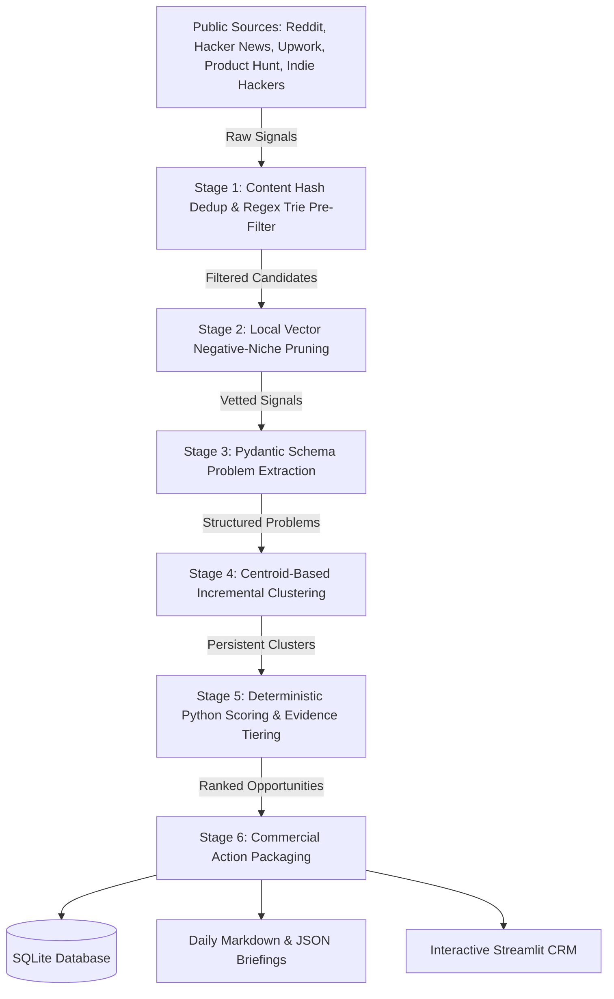

# OpportunityMiner AI 🎯

<p align="center">
  <strong>Autonomous Commercial Opportunity Intelligence Engine & Evidence-Driven CRM</strong>
</p>

<p align="center">
  
  
  
  
  
</p>

---

## 📖 Executive Summary

**OpportunityMiner AI** is an autonomous market intelligence engine that continuously discovers, extracts, clusters, and deterministically scores real commercial opportunities from public online communities and freelance marketplaces.

Instead of hallucinating startup ideas or asking LLMs what business to build, OpportunityMiner enforces an **evidence-first paradigm**:
1. **Listens to real-world friction:** Scans public forums (Reddit, Hacker News, Upwork, Product Hunt, Indie Hackers) where buyers, operators, and founders complain about manual work, software bottlenecks, and broken workflows.
2. **Filters noise at zero cost:** Employs SHA-256 deduplication and regex tries before applying local vector embeddings and LLM extraction.
3. **Applies deterministic scoring:** Evaluates opportunities with an objective 100-point mathematical rubric based on real evidence (pain intensity, recurrence, willingness to pay, and founder skill fit).
4. **Packages commercial action assets:** Synthesizes actionable 3-stage monetization ladders (Script $\rightarrow$ Retainer $\rightarrow$ Micro-SaaS) and consultative outreach drafts.
5. **Operationalizes pipeline in a CRM:** Offers an interactive Streamlit dashboard for pipeline tracking, verbatim evidence inspection, and negative-signal vector suppression.

---

## 🧠 The Four-Layer Separation Principle

To guarantee integrity and eliminate AI bias or hallucinations, OpportunityMiner enforces strict architectural boundaries across four distinct layers:

```
┌────────────────────────────────────────────────────────────────────────┐
│ 1. EVIDENCE (Pure Raw Fact)                                            │
│    Exact verbatim quotes, author handle, source URL, timestamps.       │
├────────────────────────────────────────────────────────────────────────┤
│ 2. INTERPRETATION (Objective Root Cause)                               │
│    Structural bottleneck behind symptom (always explicitly tagged).     │
├────────────────────────────────────────────────────────────────────────┤
│ 3. PROPOSED SOLUTION (Technical Architecture)                          │
│    Feasible implementation, tech stack, and modular MVP scope.         │
├────────────────────────────────────────────────────────────────────────┤
│ 4. COMMERCIAL HYPOTHESIS (Monetization Engine)                         │
│    3-stage pricing ladder, buyer persona, consultative outreach pitch. │
└────────────────────────────────────────────────────────────────────────┘
```

---

## 🏗️ System Architecture & Filtration Funnel

OpportunityMiner uses a 6-stage cost-controlled filtration funnel designed to ingest thousands of public discussions while restricting expensive extraction only to qualified commercial signals:



### Funnel Stages

| Stage | Mechanism | Cost | Purpose |
| :--- | :--- | :--- | :--- |
| **1. Lexical & Hash Filter** | SHA-256 content hashing + Regex Trie keyword matrix | **$0.00** | Drops exact duplicates and irrelevant chatter lacking both pain and domain terms. |
| **2. Vector Blacklist** | Local dense embeddings + cosine similarity | **$0.00** | Suppresses niches previously flagged by the user as undesirable. |
| **3. Structured Extraction** | Pydantic validation (LLM with offline NLP heuristic fallback) | Sub-cent | Extracts atomic problem, underlying root cause, pain quotes, and budget cues. |
| **4. Centroid Clustering** | Incremental centroid clustering with running mean vectors | **$0.00** | Groups similar problems under persistent cluster IDs (`CL-XXXX`) and tracks velocity. |
| **5. Deterministic Scoring** | Pure mathematical scoring function (0–100 pts) | **$0.00** | Objective scoring based on empirical evidence rubrics (no LLM score hallucination). |
| **6. Commercial Packaging** | Solution design & consultative outreach generation | **$0.00** | Constructs 3-tier offer ladders, outreach messages, and discovery interview plans. |

---

## 📊 Deterministic Mathematical Scoring Rubric

Opportunities are ranked out of **100 total points** using a deterministic mathematical model:

$$\text{Opportunity Score} = S_{\text{pain}} + S_{\text{freq}} + S_{\text{wtp}} + S_{\text{market}} + S_{\text{feas}} + S_{\text{fit}}$$

| Dimension | Max Points | Evaluation Criteria |
| :--- | :---: | :--- |
| **Pain Intensity** | **25 pts** | Emotional frustration cues, hours lost/week, operational disruption, blocked revenue. |
| **Market Frequency** | **15 pts** | Cadence: Continuous (15) · Daily (12) · Weekly (8) · Monthly (4) · One-off (1). |
| **Willingness to Pay (WTP)** | **20 pts** | Stated budget (12) + currently paying for flawed tools (5) + active hiring cues (3). |
| **Market Recurrence** | **15 pts** | Mention velocity, multi-source validation, recurring cluster centroids. |
| **Technical Feasibility** | **15 pts** | Complexity penalty: simple script (15) vs distributed infrastructure (4). |
| **Founder Skill Fit** | **10 pts** | Alignment with data engineering, Python, automation, SQL, and APIs. |

### Evidence Levels (L1 – L5)

* **Level 1 (Anecdotal):** Single user complaint with subjective frustration.
* **Level 2 (Corroborated):** Multiple users across independent sources reporting identical friction.
* **Level 3 (Quantified):** Evidence with concrete time lost (e.g., "5 hours/week") or operational bottleneck.
* **Level 4 (Commercial Intent):** Explicit budget stated, hiring attempt, or payment for inadequate alternative.
* **Level 5 (Verified Commercial Demand):** Recurring high-budget client demand verified across multiple platforms.

---

## 💼 3-Stage Commercial Offer Escalation Ladder

Every scored opportunity automatically receives a structured 3-stage monetization roadmap:

```
  ┌─────────────────────────────────────────────────────────────┐
  │ TIER 3: Micro-SaaS Portal ($39 – $149 / month)              │
  │ Self-service multi-tenant web application for operators.    │
  ├─────────────────────────────────────────────────────────────┤
  │ TIER 2: Managed Workflow Retainer ($400 – $1,200 / month)   │
  │ Daily automated execution, schema repair, monitoring SLA.    │
  ├─────────────────────────────────────────────────────────────┤
  │ TIER 1: One-Time Custom Fix ($250 – $750)                   │
  │ Foot-in-the-door Python script, macro, or data transform.   │
  └─────────────────────────────────────────────────────────────┘
```

---

## 🖥️ Streamlit CRM Dashboard

OpportunityMiner includes a modern, high-density Streamlit CRM dashboard:

* **📊 Executive Dashboard:** Real-time telemetry, source feed health status, score distribution graphs, and pipeline KPIs.
* **💼 Opportunity CRM:** Filterable opportunity pipeline with stage tracking (`NEW` $\rightarrow$ `INVESTIGATING` $\rightarrow$ `VALIDATING` $\rightarrow$ `PAID_PROJECT` $\rightarrow$ `WON`).
* **🔬 Dossier Detail:** Complete atomic problem teardown, root cause diagnosis, verbatim quote vault, original source permalinks, and consultative direct-message drafts.
* **🌐 Problem Clusters:** Centroid clusters, mention counts, unique source coverage, and trend velocity tracking.
* **🚫 Negative Blacklist:** Vector-suppressed keyword and niche management to prevent future noise.

---

## 🚀 Quick Start & Installation

### 1. Prerequisites
- **Python:** 3.10 or higher
- **Git:** Version control installed

### 2. Clone and Install

```bash
# Clone the repository
git clone https://github.com/Timoyaj/opportunity-miner.git
cd opportunity-miner

# Create and activate a virtual environment (optional but recommended)
python -m venv venv
venv\Scripts\activate      # Windows
source venv/bin/activate   # macOS / Linux

# Install dependencies
pip install -r requirements.txt
pip install -e .
```

### 3. Configure Environment Variables (Optional)
Copy `.env.example` to `.env`. All core features work **out of the box with zero API keys** via public feeds and heuristic extractors:

```bash
cp .env.example .env
```

```env
# Optional LLM enhancement (falls back to local NLP heuristics if unset)
GEMINI_API_KEY=
OPENAI_API_KEY=

# Optional Reddit API credentials (falls back to public JSON/RSS feeds if unset)
REDDIT_CLIENT_ID=
REDDIT_CLIENT_SECRET=
REDDIT_USER_AGENT=OpportunityMiner/0.1.0

# Database Connection (defaults to local SQLite if unset)
DATABASE_URL=sqlite:///data/opportunity_miner.db
```

---

## 🕹️ CLI Command Reference

Execute the end-to-end intelligence engine directly from your terminal:

```bash
# 1. Health Diagnostics: Verify connectivity across all source adapters
python -m opportunity_miner.cli health

# 2. General Market Scan: Ingest, filter, cluster, and score across all sources
python -m opportunity_miner.cli scan --sources all --limit 30

# 3. Targeted Domain Scan: Focus on specific topics and timeframes
python -m opportunity_miner.cli scan --query "excel automation" --days 7 --limit 25

# 4. Generate Daily Briefing: Output executive briefing to reports/YYYY/MM/
python -m opportunity_miner.cli report

# 5. Launch Streamlit Dashboard: Open interactive CRM in browser
python -m opportunity_miner.cli ui --port 8501
```

### Windows Batch Runner (`run.bat`)
On Windows systems, you can also use the bundled runner:

```cmd
run.bat health    # Check source feed availability
run.bat scan      # Run opportunity scan across active feeds
run.bat report    # Compile daily Markdown and JSON executive briefing
run.bat ui        # Launch Streamlit Opportunity CRM on port 8501
run.bat test      # Execute automated test suite
run.bat all       # Run end-to-end pipeline (health -> scan -> report)
```

---

## 🗂️ Repository & Agent Structure

```text
opportunity-miner/
├── .agents/                                # Antigravity IDE Skills & Agent Protocol
│   ├── agents/
│   │   └── opportunity-researcher/agent.md # Master agent definition
│   └── skills/                             # 13 Modular Agent Skills
│       ├── opportunity-orchestrator/       # End-to-end pipeline coordinator
│       ├── source-reddit/                  # Reddit feed ingestion & parsing
│       ├── source-hackernews/              # Hacker News Algolia scraper
│       ├── source-upwork/                  # Upwork RSS & dropzone importer
│       ├── source-indiehackers/            # Indie Hackers feed crawler
│       ├── source-producthunt/             # Product Hunt Atom & review scraper
│       ├── problem-extractor/              # Pydantic extraction schema
│       ├── problem-deduplicator/           # Hash & vector deduplication
│       ├── opportunity-clusterer/          # Running centroid clustering
│       ├── opportunity-scorer/             # Deterministic 100-pt scoring
│       ├── solution-designer/              # Technical hypothesis & MVP scope
│       ├── competitor-researcher/          # Incumbent alternative analysis
│       ├── validation-planner/             # Discovery interviews & outreach
│       └── daily-opportunity-report/       # Briefing publisher
├── config/                                 # Declarative Configuration Matrices
│   ├── sources.yaml                        # Target subreddits, RSS feeds, queries
│   ├── keywords.yaml                       # Lexical pre-filtering trie terms
│   ├── scoring.yaml                        # Mathematical weights & thresholds
│   ├── profile.yaml                        # Target founder technical capabilities
│   └── settings.yaml                       # Global engine parameters
├── data/                                   # Local Data Store (Ignored in Git)
│   ├── imports/upwork/                     # Dropzone for Upwork project JSON files
│   └── vectors/                            # Vector blacklist & centroid caches
├── reports/                                # Historical Briefings (YYYY/MM/DD)
├── src/opportunity_miner/                  # Core Python Engine
│   ├── adapters/                           # Source adapters (HN, Reddit, Upwork, etc.)
│   ├── core/                               # Filtering, vector store, clustering, scoring
│   ├── database/                           # SQLAlchemy models & session factory
│   ├── generators/                         # Solution, outreach, and report generators
│   ├── ui/                                 # Streamlit CRM frontend application
│   └── cli.py                              # Click CLI entry point
├── tests/                                  # Comprehensive pytest test suite
├── pyproject.toml                          # Package specifications
└── requirements.txt                        # Production dependencies
```

---

## 🧪 Testing & Verification

OpportunityMiner includes a comprehensive test suite covering adapters, pre-filtering, clustering mathematics, and scoring algorithms:

```bash
# Run test suite with pytest
pytest -v
```

All test cases validate:
- Zero-cost regex trie matches and SHA-256 hash collision avoidance.
- Deterministic scoring bounds ($0 \le \text{Score} \le 100$).
- Incremental centroid vector distance and cosine thresholding.
- Graceful offline fallback during source network timeouts.

---

## 📄 License

This project is distributed under the **MIT License**. See `LICENSE` for details.
